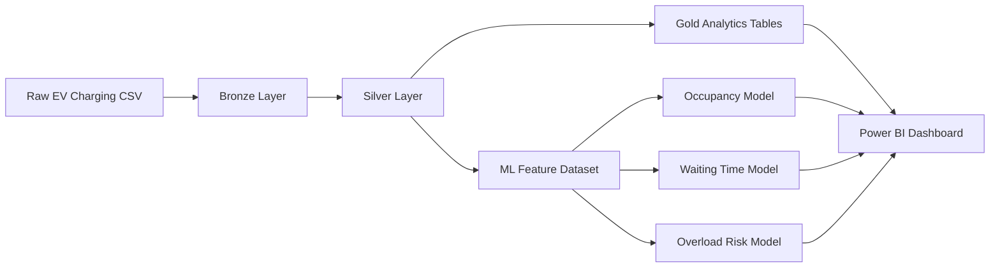

# Architecture

## Objective
Build a local Data Engineering, Analytics, and Machine Learning project that predicts charging station occupancy, waiting time, and overload risk using EV charging sessions enriched with traffic and weather data.

## Logical Architecture

## Bronze Layer
Bronze stores the raw ingested data with ingestion metadata. It preserves source columns and records for auditability.

## Silver Layer
Silver standardizes data types, trims strings, handles null values, removes duplicates, applies validation rules, and creates reusable engineering fields such as `charging_hour`, `is_peak_hour`, `station_key`, and `energy_per_hour_kwh`.

## Gold Layer
Gold contains business-ready tables for reporting:
- `station_performance`
- `traffic_analytics`
- `weather_impact_analytics`
- `charging_demand_analytics`

## Machine Learning Layer
The ML layer creates supervised learning targets for portfolio modeling:
- `station_occupancy_percent`
- `estimated_waiting_time_minutes`
- `overload_risk`

Random Forest models are trained locally with scikit-learn and saved in `models/`.

## Databricks and Delta Lake Mapping
The project runs locally with CSV files, but the design maps directly to Databricks:
- `data/bronze` maps to Delta bronze tables.
- `data/silver` maps to validated Delta tables.
- `data/gold` maps to curated analytics Delta tables.
- SQL scripts use Databricks-style `USING DELTA` syntax.
- `scripts/pyspark_delta_reference.py` shows the equivalent Spark/Delta pattern.

